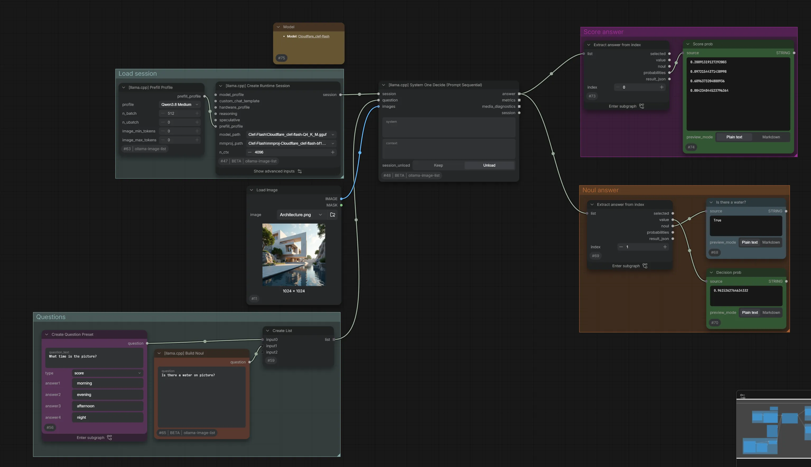

# Examples

Example workflows to help you get started.

## Model

These workflows use [unsloth/gemma-4-E4B-it-qat-GGUF](https://huggingface.co/unsloth/gemma-4-E4B-it-qat-GGUF). The Text Generation and Vision examples also use an external MTP model.

## Before running

1. If `llama` is not on your `PATH`, download the runtime from Settings → llama-multimodal → Download llama.cpp.
2. Place the model GGUF files in `ComfyUI/models/LLM`. The Vision and Choice examples also need the matching multimodal projector (`mmproj`).
3. Open a workflow in ComfyUI and select your local files in `model_path` and `mmproj_path`. For Text Generation, leave `mmproj_path` set to `[none]`.
4. For Text Generation and Vision, select the MTP file in `speculative_model`, or set `speculative_profile` to `Off` to run without it.

Replace the example images and audio with your own files before running the media workflows. Supported media types depend on the selected model.

## Text Generation

[Download workflow](./llamacpp_text.json)

Generate text from a prompt. Edit `system` to set the instructions and `prompt` to enter your request. The response appears in the Result node.

## Vision

[Download workflow](./llamacpp_vision.json)

Generate descriptions from multiple media inputs. This example sends two images and an audio clip through Sequential Generate and displays the responses in the Responses node.

## SystemOne

[Download workflow](./llamacpp_systemone.json)

Noul / Score system one about an image. This example asks whether the scene is morning, evening, afternoon, night and whether water is present, then displays the selected scores and their probabilities.

## Choice (Prefill - Legacy)

[Download workflow](./llamacpp_choice.json)

Compare candidate answers to questions about an image. This example asks whether the scene is day or night and whether water is present, then displays the selected answers and their probabilities.

It uses other way to get choice without `systemone` route, but might be ineffective on `systemone` models.
